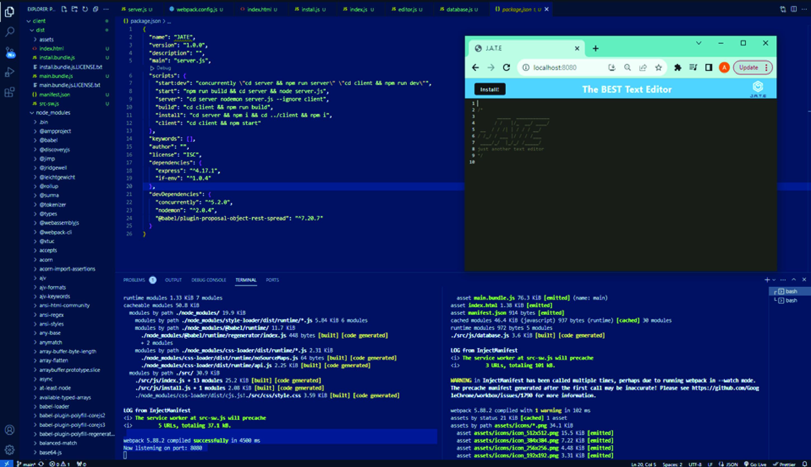
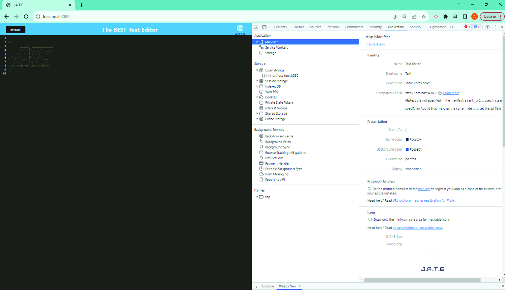
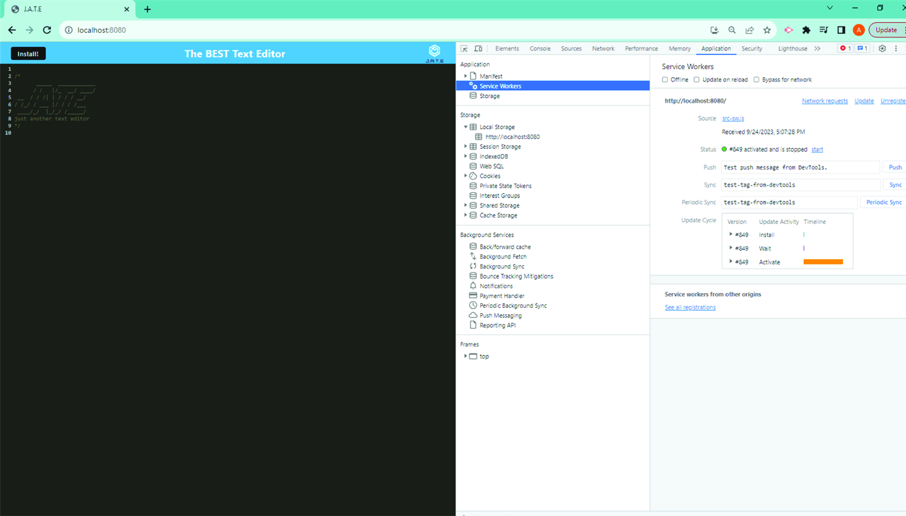
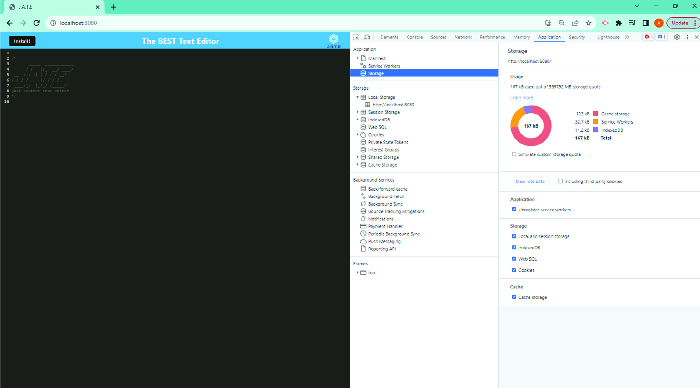
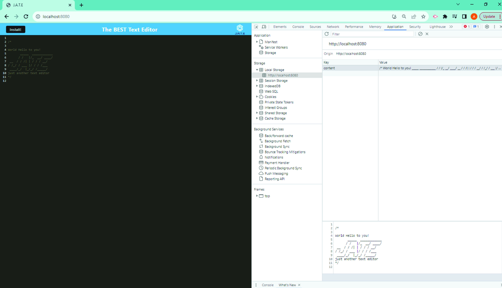
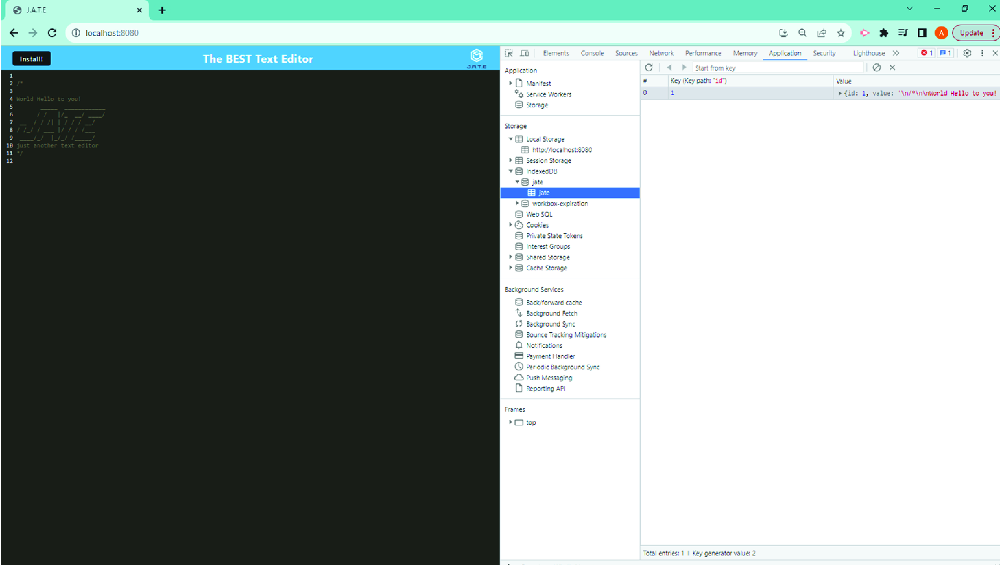

# Progressi-TextEditor-WebApp

https://serene-crag-96191-1d54036ef90f.herokuapp.com/

## Table of Contents

- [Description](#description)

- [Technologies-Used](#technologies-used)

- [Screenshots](#screenshots)

- [License](#license)

- [Contact](#contact)

- [Resources](#resources)

## Description

Progressi app is designed as a text editor that runs in the browser. The app is a single-page application that meets the PWA criteria. It features a number of data persistence techniques that serve as redundancy in case one of the options is not supported by the browser. The application also functions offline.

To build this text editor, you will start with an existing application and implement methods for getting and storing data to an IndexedDB database. You will use a package called `idb`, which is a lightweight wrapper around the IndexedDB API. It features a number of methods that are useful for storing and retrieving data, and is used by companies like Google and Mozilla.

## Technologies Used

There are a few technologies that were utilized as bases for this project: Express.js, Node.js, JavaScript, MongoDB, and Mongoose, MongoDB Compass helped to visualize the data. Additionally, Insomnia application,was used to test the CRUD functionality.

## Screenshots

NPM RUN START 
 

Manifest

Service Workers

Storage

Local Storage

Jate Database Table

## License

MIT License

## Contact

[Link to Github](https://github.com/anna071387)

## Resources

Starter code provided by The University of Utah EDX Bootcamp program.